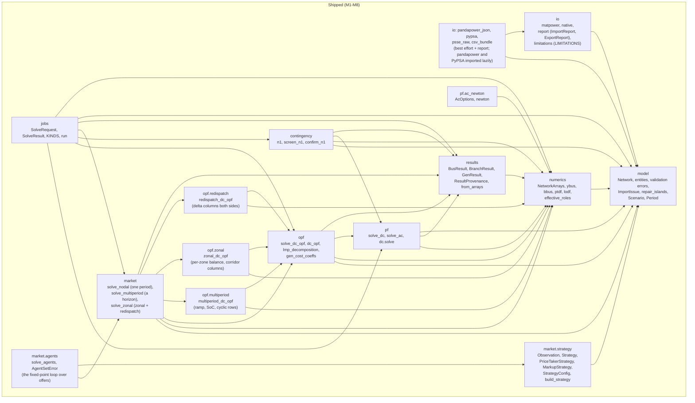
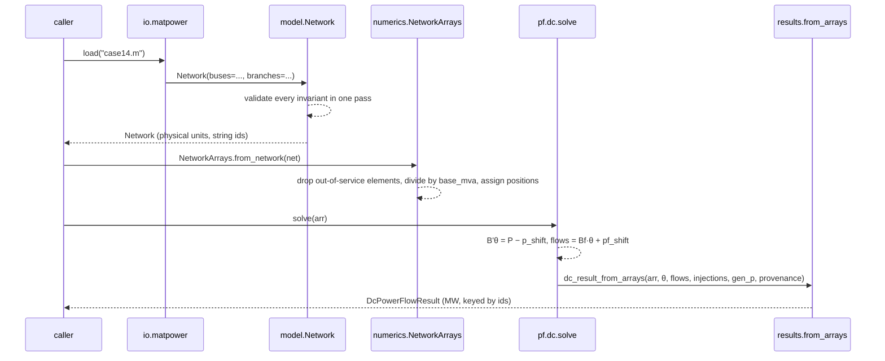

# Architecture

mambo-power is one Python package, `mambo_power`, split into modules with a strict import
direction. Only two kinds of objects cross module boundaries: **model** types (`Network` and
its entities) and **results** types. Numerics are derived views; no module holds global
state; every public function takes and returns pydantic models.

## Component diagram

Solid arrows are the allowed import directions today; the lower group holds modules that
later waves add (their dependencies are already fixed by the epic design).



Rules the diagram encodes:

- `io` speaks only `model`. An importer produces a `Network`, an exporter consumes one; neither
  touches arrays or solvers. Since M8 every importer returns an `ImportReport` and every
  exporter an `ExportReport` (`io.report`) under one rule: an empty report means the
  conversion was lossless, and anything dropped, approximated or repaired is an issue naming
  the element id and the field. The format modules import pandapower and PyPSA lazily inside
  the functions that need them, so `import mambo_power` never needs either;
  `io.limitations.LIMITATIONS` registers every code a module can emit (it imports the format
  modules; `io.report` is a leaf they all import), and a test pins that each is documented.
- `numerics` is the **only** module that holds positional indices and the **single** site
  where physical units are divided by `base_mva`.
- Solvers (`pf`, `opf`, `contingency`, `market`) consume `NetworkArrays`, never a `Network`
  directly, and hand plain arrays to `results.from_arrays`, which walks back to ids and
  multiplies by `base_mva` on the way out. `opf` also calls `pf.solve_ac` directly for its
  post-dispatch AC-feasibility check; `contingency` calls `pf.dc.solve` for its confirming
  re-solve — neither reimplements power flow.
- `market` composes `opf.dc_opf`/`opf.lmp_decomposition` directly (its `Scenario`-facing
  wrapper over the same welfare LP, extended for elastic demand); it never reimplements them.
  `market.multiperiod` sits at the same altitude over `opf.multiperiod` — it does **not** call
  `market.nodal`'s clearing, only its `load_bid_coeffs` extractor, shared rather than copied.
  `opf.multiperiod` in turn calls `opf.dc_opf`'s own balance / flow-limit / epigraph / hypograph
  row builders per period and adds the three coupling families (ramp, state of charge, cyclic)
  on top; it is one builder with more row families, not a second solver. Later market modes
  (agents) extend the same seam.
- `opf.zonal` and `opf.redispatch` are the third and fourth callers of that same row-family core,
  and they take it in opposite directions. `opf.zonal` uses `_balance_row` once per **zone** and
  calls `_flow_limit_rows` **never** — a zonal clearing that consulted the PTDF would be modelling
  something else. `opf.redispatch` uses both, with the starting operating point folded into each
  row's fixed right-hand side, and introduces no new row-family helper of its own: the one row it
  genuinely needs (the linking equality tying a piecewise-linear participant's delta pair to a
  single quantity column) is an instance of `_balance_row`, which is pure algebra over LP column
  indices and does not care what a column represents.
- Cost/bid extraction and both convexity guards live in **one** helper,
  `opf.dc_opf._extract_and_validate`, which all four builders call. It was extracted and proved
  behaviour-preserving before any zonal row was written, on the principle that a fourth caller is
  the point at which a duplicated preamble stops being duplication and starts being divergence.
- `market.zonal` composes three solves — `opf.zonal`, then `opf.redispatch`, then
  `market.nodal.solve_nodal` as a reference — and imports `market.nodal`'s `load_bid_coeffs` and
  `solve_nodal` by name only, the same shared-not-copied arrangement `market.multiperiod` uses.
  The nodal reference is a genuinely separate solve, not a quantity inferred from the redispatch,
  because the two agreeing is what the wave's own tests assert.
- `market.strategy` is a **seam, not a solver**, and its import direction says so: it reaches
  `model` and nothing else — no `numerics`, no `opf`, no `results`. An offer is a
  `GeneratorCost`, the model's own discriminated union, decided from an own-node `Observation`
  carrying the agent's own cost, its own limits and its own last two rounds. That narrowness is
  the design constraint made mechanical rather than merely documented: a strategy with a path to
  the clearing could reconstruct the merit order and short-circuit the game the agents loop
  exists to play out. `Strategy` is a `typing.Protocol`, not an ABC — one method, structural
  conformance, and no other ABC in the repo to match — so an in-process caller may pass any
  conforming object; what crosses the `jobs` boundary is `StrategyConfig`, a discriminated union
  on `kind` resolved to an instance by `build_strategy`, never a callable. The offer is an
  **overlay**, not a mutation: `Generator.cost` keeps the true cost untouched, which is the only
  reason "markup" is a quantity this package can compute at all.
- `jobs` is the outermost layer: it validates a request, calls a solver entry point (`pf`,
  `opf`, `contingency` or `market`, by kind), times it and wraps any exception into a
  structured failure. Since M5 its subject is a `Scenario`: a request carries either a bare
  `network` or a `scenario`, and `SolveRequest.resolved_scenario` wraps the former, so every
  runner has the one `(Scenario, options) -> result` shape.
- pandapower and PyPSA appear nowhere in this graph. They are development dependencies used
  by the parity test tier only.

## Ownership table

Each concept has exactly one owner (single source of truth). The agreement test is what keeps
consumers honest when the owner changes.

| Concept | Owner (SSoT) | Consumers | Agreement test |
| --- | --- | --- | --- |
| Network schema | `model` | io, numerics, jobs, future SaaS | round-trip of every importer against schema fixtures; JSON-schema snapshot test |
| Per-unit conversion and positional indices | `numerics.NetworkArrays` | every solver, `results.from_arrays` | Ybus parity against pandapower `makeYbus` on the IEEE fixtures (fails if the conversion drifts) |
| Power-flow solutions | `pf` | contingency, market (AC feasibility check), results | parity against MATPOWER published solutions and pandapower `runpp` / `rundcpp` |
| Effective bus roles | `numerics.effective_roles` (M2) | pf.ac, pf.dc, results | modified-case14 fixture vs pandapower |
| Island repair | `model.repair_islands` (M2) | every importer | islanded case14 variant: warning emitted, main island matches pandapower |
| Result provenance | `results.ResultProvenance` | jobs, docs | `provenance.version == mambo_power.__version__` |
| DC-OPF formulation | `opf` (M3) | market.*, jobs | parity against pandapower `rundcopp` (primary) and PyPSA `optimize` (secondary) |
| N-1 screen-vs-confirm | `contingency.n1` (M3) | jobs | brute-force all-outage sweep agrees with the LODF screen + DC re-solve on every fixture |
| LMP / congestion rent | `market.nodal` (M4) | zonal comparison, multiperiod, agents | settlement identities; LMP(slack) = λ |
| Ramp / SoC / cyclic row families | `opf.multiperiod` (M5) | sole caller `market.multiperiod` | hand-derived ramp optimum; analytic 2-bus/2-period arbitrage; PyPSA multi-period parity |
| Cost/bid extraction and the convexity guards | `opf.dc_opf._extract_and_validate` (M6) | `dc_opf`, `opf.multiperiod`, `opf.zonal`, `opf.redispatch` | the whole prior suite passes with zero test edits on a tree differing only in the unified files |
| Zone price | zonal balance-row dual, `opf.zonal` (M6) | `MarketZonalResult.zones`, manual | copper-plate degenerate: every zone price equals the nodal λ |
| Corridor transfer capacity | caller-supplied `market.CorridorLimit` (M6) | zonal variable bounds, PyPSA `Link` `p_nom` | capacities handed to the oracle independently of the engine |
| Final dispatch == the nodal optimum | `opf.redispatch`'s true-curve objective (M6) | `welfare_gap`, the redispatch rows | `assert_allclose` against `market.solve_nodal` from unrelated starting points |
| Offered cost, as distinct from true cost | `market.strategy` (M7) | `market.agents`, `jobs` | `PriceTakerStrategy` returns `Observation.true_cost` verbatim — coefficients compared with `==`, and a piecewise true cost asserted `is`-or-`==` identical, not reconstructed |
| An agent's own-node history | `market.strategy.Observation` (M7) | every `Strategy` implementation | a skipped round (`two_rounds_ago` set, `previous_round` not) and a stale one (a record whose own `round_index` is not the slot's) both raise, so a non-adjacent pair cannot pass as history |
| Storage physical limits | `model.Storage` (M1, solver-read from M5) | LP bounds, result rows, docs | SoC balance every period; cyclic `SoC_T == soc_initial`; `min(charge, discharge) ≈ 0` invariant with a paired positive case |
| Horizon shape | `model.Scenario.periods` / `model.Period` | `market.multiperiod`, `jobs` | `periods=None` reproduces `market.nodal` bit-exactly (`==`, not a tolerance) |
| Analysis kinds registry | `jobs` | future SaaS capability list | contract test: every kind has request model, result model, runner |

## Data flow of one solve



The public entry point `pf.solve_dc(net)` performs the three middle steps for you and stamps
the provenance. The network is never modified; the result is a separate value.

## Module map on disk

```text
src/mambo_power/
  __init__.py       __version__ from package metadata
  model/            entities.py (Bus, Branch, Generator, ...), network.py (Network, validate_network),
                    scenario.py (Scenario, Period), islands.py, warnings.py, errors.py
  io/               matpower.py (load, loads, *_with_warnings), native.py (load, loads, save, dumps),
                    report.py (ImportReport, ExportReport), limitations.py (LIMITATIONS),
                    pandapower_json.py (load*, dump*), pypsa.py (to_network*),
                    psse_raw.py (load*), csv_bundle.py (dump, load*)
  numerics/         arrays.py (NetworkArrays), ybus.py, bbus.py, ptdf.py, lodf.py, roles.py, errors.py
  pf/               __init__.py (solve_dc, solve_ac), dc.py (solve, DcSolution), ac_newton.py, _common.py
  opf/              __init__.py (solve_dc_opf, gen_cost_coeffs), dc_opf.py (dc_opf, lmp_decomposition),
                    multiperiod.py (multiperiod_dc_opf), zonal.py (zonal_dc_opf),
                    redispatch.py (redispatch_dc_opf)
  contingency/      __init__.py (n1), n1.py (screen_n1, confirm_n1)
  market/           __init__.py, nodal.py (solve_nodal), multiperiod.py (solve_multiperiod),
                    zonal.py (solve_zonal, CorridorLimit),
                    strategy.py (Observation, Strategy, PriceTakerStrategy, MarkupStrategy,
                                 StrategyConfig, build_strategy)
  results/          tables.py, provenance.py, power_flow.py, from_arrays.py, opf.py, n1.py, feasibility.py,
                    market.py, multiperiod.py, zonal.py
  jobs/             __init__.py, models.py (SolveRequest, SolveResult), registry.py (KINDS), run.py (run, run_json)
```

The test suite mirrors the boundaries: `tests/unit` exercises each module hermetically,
`tests/parity` compares against the oracles, `tests/property` runs hypothesis over random
radial and meshed networks. See [Contributing](../contributing.md).
