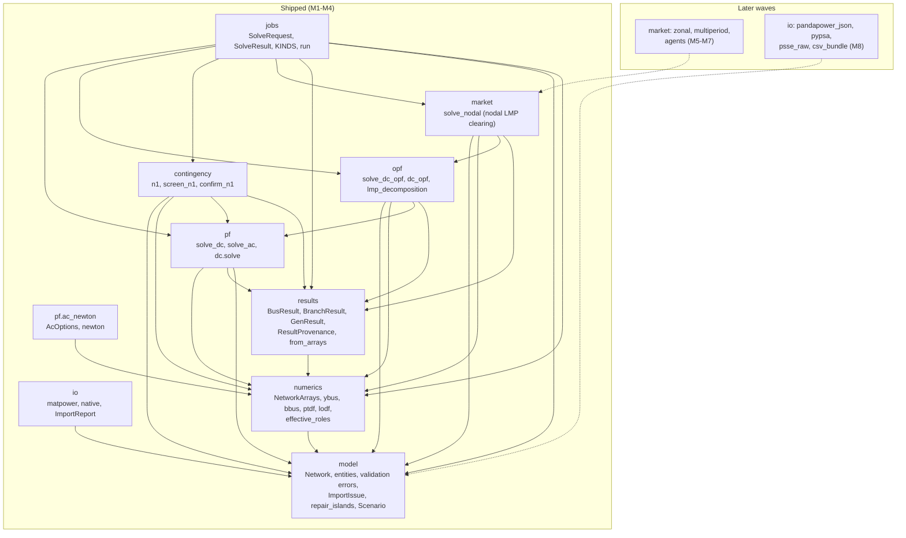
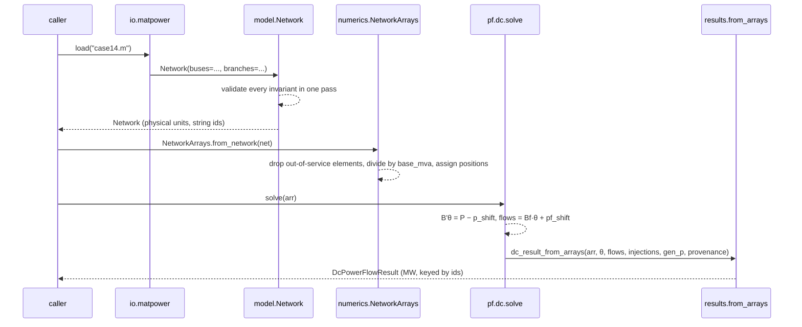

# Architecture

mambo-power is one Python package, `mambo_power`, split into modules with a strict import
direction. Only two kinds of objects cross module boundaries: **model** types (`Network` and
its entities) and **results** types. Numerics are derived views; no module holds global
state; every public function takes and returns pydantic models.

## Component diagram

Solid arrows are the allowed import directions today; the lower group holds modules that
later waves add (their dependencies are already fixed by the epic design).



Rules the diagram encodes:

- `io` speaks only `model`. An importer produces a `Network`; it never touches arrays or
  solvers.
- `numerics` is the **only** module that holds positional indices and the **single** site
  where physical units are divided by `base_mva`.
- Solvers (`pf`, `opf`, `contingency`, `market`) consume `NetworkArrays`, never a `Network`
  directly, and hand plain arrays to `results.from_arrays`, which walks back to ids and
  multiplies by `base_mva` on the way out. `opf` also calls `pf.solve_ac` directly for its
  post-dispatch AC-feasibility check; `contingency` calls `pf.dc.solve` for its confirming
  re-solve — neither reimplements power flow.
- `market` composes `opf.dc_opf`/`opf.lmp_decomposition` directly (its `Scenario`-facing
  wrapper over the same welfare LP, extended for elastic demand); it never reimplements them.
  Later market modes (zonal, multiperiod, agents) build on `market.nodal` in turn, not on
  `opf` directly.
- `jobs` is the outermost layer: it validates a request, calls a solver entry point (`pf`,
  `opf`, `contingency` or `market`, by kind), times it and wraps any exception into a
  structured failure.
- pandapower and PyPSA appear nowhere in this graph. They are development dependencies used
  by the parity test tier only.

## Ownership table

Each concept has exactly one owner (single source of truth). The agreement test is what keeps
consumers honest when the owner changes.

| Concept | Owner (SSoT) | Consumers | Agreement test |
| --- | --- | --- | --- |
| Network schema | `model` | io, numerics, jobs, future SaaS | round-trip of every importer against schema fixtures; JSON-schema snapshot test |
| Per-unit conversion and positional indices | `numerics.NetworkArrays` | every solver, `results.from_arrays` | Ybus parity against pandapower `makeYbus` on the IEEE fixtures (fails if the conversion drifts) |
| Power-flow solutions | `pf` | contingency, market (AC feasibility check), results | parity against MATPOWER published solutions and pandapower `runpp` / `rundcpp` |
| Effective bus roles | `numerics.effective_roles` (M2) | pf.ac, pf.dc, results | modified-case14 fixture vs pandapower |
| Island repair | `model.repair_islands` (M2) | every importer | islanded case14 variant: warning emitted, main island matches pandapower |
| Result provenance | `results.ResultProvenance` | jobs, docs | `provenance.version == mambo_power.__version__` |
| DC-OPF formulation | `opf` (M3) | market.*, jobs | parity against pandapower `rundcopp` (primary) and PyPSA `optimize` (secondary) |
| N-1 screen-vs-confirm | `contingency.n1` (M3) | jobs | brute-force all-outage sweep agrees with the LODF screen + DC re-solve on every fixture |
| LMP / congestion rent | `market.nodal` (M4) | zonal comparison, multiperiod, agents | settlement identities; LMP(slack) = λ |
| Analysis kinds registry | `jobs` | future SaaS capability list | contract test: every kind has request model, result model, runner |

## Data flow of one solve



The public entry point `pf.solve_dc(net)` performs the three middle steps for you and stamps
the provenance. The network is never modified; the result is a separate value.

## Module map on disk

```text
src/mambo_power/
  __init__.py       __version__ from package metadata
  model/            entities.py (Bus, Branch, Generator, ...), network.py (Network, validate_network), errors.py
  io/               matpower.py (load, loads, *_with_warnings), native.py (load, loads, save, dumps)
  numerics/         arrays.py (NetworkArrays), ybus.py, bbus.py, ptdf.py, lodf.py
  pf/               __init__.py (solve_dc), dc.py (solve, DcSolution)
  opf/              __init__.py (solve_dc_opf), dc_opf.py (dc_opf, lmp_decomposition)
  contingency/      __init__.py (n1), n1.py (screen_n1, confirm_n1)
  market/           __init__.py (solve_nodal), nodal.py (solve_nodal, MarketNodalOptions)
  results/          tables.py, provenance.py, power_flow.py, from_arrays.py, opf.py, n1.py, feasibility.py, market.py
```

The test suite mirrors the boundaries: `tests/unit` exercises each module hermetically,
`tests/parity` compares against the oracles, `tests/property` runs hypothesis over random
radial and meshed networks. See [Contributing](../contributing.md).
