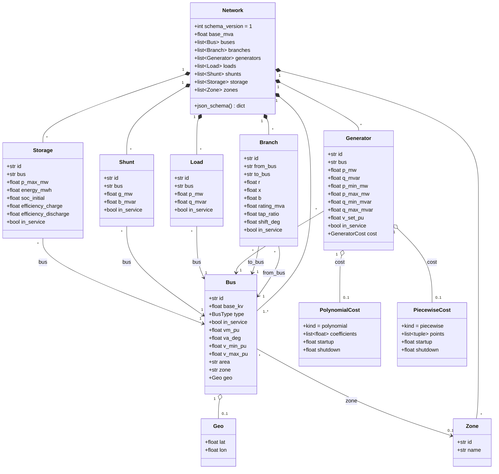
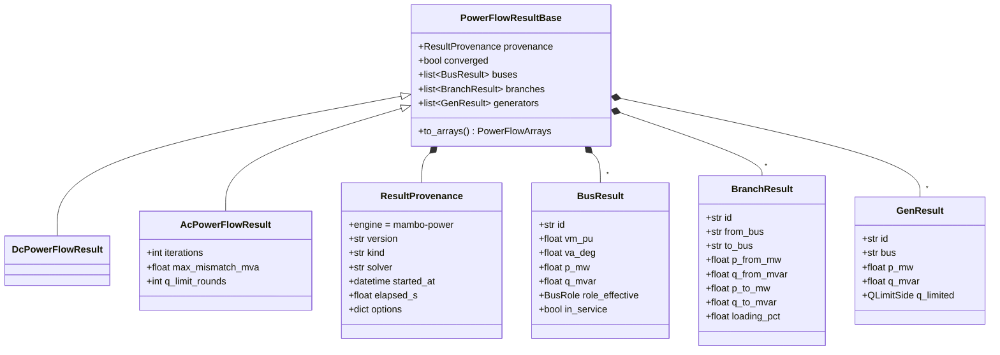

# Data model

The native file format **is** the pydantic model: `Network.model_dump_json()` writes it,
`Network.model_validate_json()` reads it, and `Network.json_schema()` emits the JSON schema
that is snapshot-tested in CI. The diagram shows the entities, their key fields and
multiplicities; the [Network model manual page](../manual/model.md) has the full field tables.

## Class diagram

Optional fields (`vm_pu`, `va_deg`, `v_min_pu`, `v_max_pu`, `area`, `zone`, `geo`,
`rating_mva`, `tap_ratio`, `shift_deg`, `cost`, `name`) default to `None` and are omitted
from native JSON on write. `in_service` defaults to `true` everywhere.

References between entities are **string ids**, never object references or positional
integers. `Network` validation checks that every reference resolves (`DANGLING_REF`) and that
ids are unique within each collection (`DUPLICATE_ID`). Positional integers exist only inside
`numerics.NetworkArrays`.

## Units convention

The model stores **physical units**, exactly as MATPOWER and pandapower files do, so files stay
human-readable and interop stays lossless. Per-unit conversion happens in exactly one place,
`NetworkArrays.from_network`, and never in the model.

| Quantity | Unit in the model | Field suffix | Converted in `NetworkArrays` as |
| --- | --- | --- | --- |
| Active power | MW | `_mw` | `/ base_mva` → pu |
| Reactive power | MVAr | `_mvar` | `/ base_mva` → pu |
| Apparent power (ratings) | MVA | `_mva` | `/ base_mva` → pu (`inf` when absent) |
| Energy | MWh | `_mwh` | not consumed by a solver yet |
| Voltage magnitude | per unit of `base_kv` | `_pu` | unchanged |
| Voltage angle, phase shift | degrees | `_deg` | `radians()` |
| Bus nominal voltage | kV | `base_kv` | unchanged (not needed by the pu formulation) |
| Branch `r`, `x`, `b` | per unit on `base_mva` | none | unchanged |
| Tap ratio | dimensionless, from-side | `tap_ratio` | `1.0` when `None` |
| Shunt | MW consumed / MVAr injected at 1.0 pu | `g_mw`, `b_mvar` | `/ base_mva` → pu admittance |

Field names are snake_case with the unit suffix; booleans are booleans (`in_service: bool`
rather than a `0 | 1` status integer); the bus role is a closed literal
`"slack" | "pv" | "pq"` and MATPOWER's type 4 (isolated) maps to `in_service = False`.

## Result tables

Results mirror the model's id convention: every row names the element by id, units are
physical, and `None` (never `NaN`) marks a quantity that does not exist.

See [Manual › Results](../manual/results.md) for the field semantics and the JSON round-trip.
