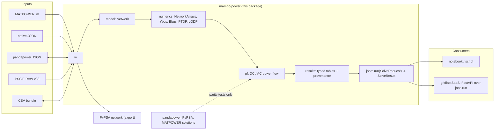

# mambo-power

**mambo-power** is a fundamental Python package for power system analysis and electricity
market modelling. It owns its network data model and implements its own solvers — AC and DC
power flow today, DC optimal power flow, N-1 contingency analysis and four market-clearing
modes on the roadmap — on top of numpy, scipy and HiGHS.

```python
from mambo_power.io import matpower
from mambo_power import pf

net = matpower.load("fixtures/matpower/case14.m")
result = pf.solve_dc(net)
print(result.branches[0].p_from_mw)
```

!!! info "Status"
    All nine foundation waves are merged. **M1** laid the substrate — the network model,
    MATPOWER import, Ybus/Bbus/PTDF/LODF matrices. **M2** shipped DC/AC Newton-Raphson power
    flow, typed results, the stateless [jobs API](manual/jobs.md) and this documentation
    site. **M3** added DC optimal power flow with duals and N-1 branch-contingency screening.
    **M4**–**M6** shipped three market-clearing modes: nodal (elastic demand, LMP-based
    settlement — `market.solve_nodal`, see [Manual › Nodal market](manual/market.md)),
    multiperiod (a whole horizon as one coupled LP/QP with ramp coupling, storage state of
    charge and a cyclic end condition — `market.solve_multiperiod`, see [Manual › Multiperiod
    market](manual/multiperiod.md)), and zonal (zonal clearing, minimum-cost redispatch and
    the comparison against the nodal optimum — `market.solve_zonal`, see [Manual › Zonal
    market](manual/zonal.md)). **M7** added agent-based bidding — generators that *offer*
    through a `Strategy`, the market clearing the offered curves round after round until they
    settle (`market.solve_agents`, see [Manual › Agent-based bidding](manual/agents.md)).
    **M8** shipped interchange — pandapower JSON in both directions, PyPSA export, a PSS/E RAW
    v33 importer and a bit-exact CSV bundle, every conversion returning a report that names
    what it could not carry (`io.pandapower_json`, `io.pypsa`, `io.psse_raw`,
    `io.csv_bundle`, see [Manual › File formats](manual/formats.md)), and `Branch.kind`
    telling a line from a transformer. **M9** closed the epic — narrative
    [tutorials](tutorials/index.md), an automated changelog and the PyPI trusted-publishing
    pipeline. Nothing is on PyPI yet — install from source (see [Getting
    started](getting-started.md)).

## Three principles

### 1. Own model, own solvers

`mambo_power.model` defines the network (a pydantic v2 model whose JSON **is** the native
file format), and `pf`, `opf`, `contingency` and `market` implement their own formulations.
pandapower and PyPSA are *development-only* dependencies: they serve as parity oracles in the
test suite, and the only package code that touches them — the `io.pandapower_json` and
`io.pypsa` converters — imports them lazily inside the functions that need them, so
`import mambo_power` never does. The installed package depends on exactly `numpy`, `scipy`,
`highspy` and `pydantic`.

### 2. Free in both senses

Open-source stack end to end — no paid solvers, no licences — and built, tested, documented
and published entirely on free infrastructure: GitHub, GitHub Actions, GitHub Pages and PyPI
trusted publishing. Nothing in build, test, docs or release is billed.

### 3. A foundation for a service, not a notebook toolbox

Every analysis is reachable through one stateless, JSON-serialisable surface —
`jobs.run(SolveRequest) -> SolveResult` — that is safe to call from a notebook, a CLI, a
worker queue or an HTTP handler. Results are values stamped with provenance (engine version,
solver, timings, diagnostics); they are never stored on the network object. A commercial web
product (the *gridlab* repository) will be layered on top of this package as a published
dependency, adding transport and persistence but never semantics.

## System context



## Where to go next

| You want to… | Read |
| --- | --- |
| Install and run a first power flow | [Getting started](getting-started.md) |
| Follow a guided walkthrough, start to finish | [Tutorials](tutorials/index.md) |
| Understand the network model, its units and validation errors | [Manual › Network model](manual/model.md) |
| Import a MATPOWER, pandapower or PSS/E RAW case; export to pandapower, PyPSA or a CSV bundle | [Manual › File formats](manual/formats.md) |
| Build Ybus, Bbus, PTDF or LODF matrices | [Manual › Numerics](manual/numerics.md) |
| Run a DC or AC power flow, understand Q-limits and effective roles | [Manual › Power flow](manual/power-flow.md) |
| Solve DC-OPF for cost-minimising dispatch and LMPs | [Manual › DC-OPF](manual/opf.md) |
| Screen for N-1 branch-contingency violations | [Manual › N-1 screening](manual/n1.md) |
| Clear a nodal market with elastic demand, LMPs and settlement | [Manual › Nodal market](manual/market.md) |
| Clear a whole horizon with ramp limits and storage | [Manual › Multiperiod market](manual/multiperiod.md) |
| Clear zonally, redispatch, and price what the simplification cost | [Manual › Zonal market](manual/zonal.md) |
| Read and serialise results | [Manual › Results](manual/results.md) |
| Call the package from a service | [Manual › Jobs API](manual/jobs.md) |
| Copy a working script | [Examples](examples/index.md) |
| Browse every public class and function | [API reference](api/model.md) |
| See how the packages fit together and why | [Design](design/architecture.md) |
| Contribute a change | [Contributing](contributing.md) |

## Roadmap (epic 01 — foundation)

| Wave | Scope | State |
| --- | --- | --- |
| M1 | Installable package, `Network` model, MATPOWER import, Ybus/Bbus/PTDF/LODF, CI matrix | merged |
| M2 | DC + AC Newton-Raphson power flow, typed results, `jobs` API, docs site, examples | merged |
| M3 | DC optimal power flow with duals on HiGHS, N-1 branch-contingency screening | merged |
| M4 | Nodal market: elastic-demand DC-OPF, LMP clearing, settlement | merged |
| M5 | Multiperiod market: 24-period horizon, ramp coupling, storage SoC, per-period settlement | merged |
| M6 | Zonal market: zonal clearing, min-cost redispatch, nodal-vs-zonal comparison | merged |
| M7 | Agent-based bidding: strategies, offered-vs-true cost overlay, fixed-point loop | merged |
| M8 | Interchange: pandapower JSON, PyPSA, PSS/E RAW, CSV bundle | merged |
| M9 | Tutorials, semantic-release changelog, PyPI 0.1.0 trusted publishing | merged |

mambo-power is MIT licensed. Source: [github.com/mambo10005/mambo-power](https://github.com/mambo10005/mambo-power).
