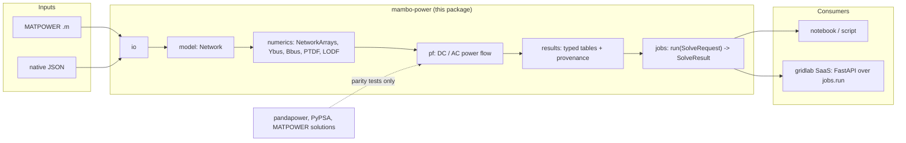

# mambo-power

**mambo-power** is a fundamental Python package for power system analysis and electricity
market modelling. It owns its network data model and implements its own solvers — AC and DC
power flow today, DC optimal power flow, N-1 contingency analysis and four market-clearing
modes on the roadmap — on top of numpy, scipy and HiGHS.

```python
from mambo_power.io import matpower
from mambo_power import pf

net = matpower.load("fixtures/matpower/case14.m")
result = pf.solve_dc(net)
print(result.branches[0].p_from_mw)
```

!!! info "Status"
    Wave **M1** (substrate: model, MATPOWER import, network matrices), wave **M2** (DC/AC
    Newton-Raphson power flow, typed results, the stateless [jobs API](manual/jobs.md), this
    documentation site), wave **M3** (DC optimal power flow with duals, N-1
    branch-contingency screening), wave **M4** (nodal-market clearing: elastic demand,
    LMP-based settlement — `market.solve_nodal`, see [Manual › Nodal
    market](manual/market.md)) and wave **M5** (a whole horizon cleared as one coupled LP/QP
    with generator ramp coupling, storage state of charge and a cyclic end-of-horizon
    condition — `market.solve_multiperiod`, see [Manual › Multiperiod
    market](manual/multiperiod.md)) are all merged. Wave **M6** (zonal clearing and
    redispatch) is in progress on its own wave branch, with everything below shipped there: a
    market cleared at zonal granularity, a minimum-cost redispatch that makes its schedule
    deliverable on the real network, and the comparison against the nodal optimum that
    measures what the zonal design costs (`market.solve_zonal`, see [Manual › Zonal
    market](manual/zonal.md)), exposed through `jobs.run` as `kind="market.zonal"`, and a new
    [runnable example](examples/index.md#11-zonal-redispatch). Nothing is on PyPI yet —
    install from source (see [Getting started](getting-started.md)).

## Three principles

### 1. Own model, own solvers

`mambo_power.model` defines the network (a pydantic v2 model whose JSON **is** the native
file format), and `pf`, `opf`, `contingency` and `market` implement their own formulations.
pandapower and PyPSA are *development-only* dependencies: they serve as parity oracles in the
test suite and are never imported by package code. The installed package depends on exactly
`numpy`, `scipy`, `highspy` and `pydantic`.

### 2. Free in both senses

Open-source stack end to end — no paid solvers, no licences — and built, tested, documented
and published entirely on free infrastructure: GitHub, GitHub Actions, GitHub Pages and PyPI
trusted publishing. Nothing in build, test, docs or release is billed.

### 3. A foundation for a service, not a notebook toolbox

Every analysis is reachable through one stateless, JSON-serialisable surface —
`jobs.run(SolveRequest) -> SolveResult` — that is safe to call from a notebook, a CLI, a
worker queue or an HTTP handler. Results are values stamped with provenance (engine version,
solver, timings, diagnostics); they are never stored on the network object. A commercial web
product (the *gridlab* repository) will be layered on top of this package as a published
dependency, adding transport and persistence but never semantics.

## System context



## Where to go next

| You want to… | Read |
| --- | --- |
| Install and run a first power flow | [Getting started](getting-started.md) |
| Understand the network model, its units and validation errors | [Manual › Network model](manual/model.md) |
| Import a MATPOWER case or write native JSON | [Manual › File formats](manual/formats.md) |
| Build Ybus, Bbus, PTDF or LODF matrices | [Manual › Numerics](manual/numerics.md) |
| Run a DC or AC power flow, understand Q-limits and effective roles | [Manual › Power flow](manual/power-flow.md) |
| Solve DC-OPF for cost-minimising dispatch and LMPs | [Manual › DC-OPF](manual/opf.md) |
| Screen for N-1 branch-contingency violations | [Manual › N-1 screening](manual/n1.md) |
| Clear a nodal market with elastic demand, LMPs and settlement | [Manual › Nodal market](manual/market.md) |
| Clear a whole horizon with ramp limits and storage | [Manual › Multiperiod market](manual/multiperiod.md) |
| Clear zonally, redispatch, and price what the simplification cost | [Manual › Zonal market](manual/zonal.md) |
| Read and serialise results | [Manual › Results](manual/results.md) |
| Call the package from a service | [Manual › Jobs API](manual/jobs.md) |
| Copy a working script | [Examples](examples/index.md) |
| Browse every public class and function | [API reference](api/model.md) |
| See how the packages fit together and why | [Design](design/architecture.md) |
| Contribute a change | [Contributing](contributing.md) |

## Roadmap (epic 01 — foundation)

| Wave | Scope | State |
| --- | --- | --- |
| M1 | Installable package, `Network` model, MATPOWER import, Ybus/Bbus/PTDF/LODF, CI matrix | merged |
| M2 | DC + AC Newton-Raphson power flow, typed results, `jobs` API, docs site, examples | merged |
| M3 | DC optimal power flow with duals on HiGHS, N-1 branch-contingency screening | merged |
| M4 | Nodal market: elastic-demand DC-OPF, LMP clearing, settlement | merged |
| M5 | Multiperiod market: 24-period horizon, ramp coupling, storage SoC, per-period settlement | merged |
| M6 | Zonal market: zonal clearing, min-cost redispatch, nodal-vs-zonal comparison | in progress |
| M7 | Markets: agent-based bidding | planned |
| M8 | Interchange: pandapower JSON, PyPSA, PSS/E RAW, CSV bundle | planned |
| M9 | PyPI 0.1.0 with trusted publishing and semantic-release | planned |

mambo-power is MIT licensed. Source: [github.com/mambo10005/mambo-power](https://github.com/mambo10005/mambo-power).
