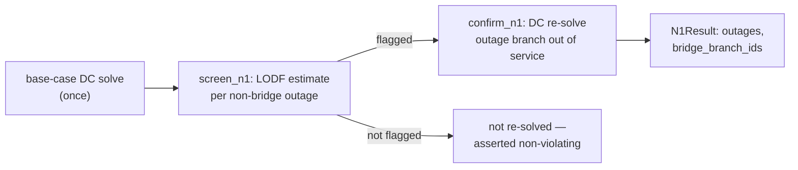

# N-1 contingency screening

`mambo_power.contingency` holds N-1 branch-contingency screening: for every branch outage that
would not disconnect the network, estimate whether any other branch's flow would exceed its
rating, then confirm each flagged estimate with a real DC re-solve. The public entry point takes
a `Network` and returns a typed [result](results.md); the array-level split
(`contingency.n1.screen_n1`, `contingency.n1.confirm_n1`) mirrors `pf.dc.solve`. **Branch outages
only** — generator-outage contingencies are an explicit carry-over, not silently dropped (see
[Scope](#scope) below).

| Entry point | Returns |
| --- | --- |
| `contingency.n1(net, options=None)` | `N1Result` |
| `contingency.n1.screen_n1(arr, options)` | `N1Screen` (positional) |
| `contingency.n1.confirm_n1(net, arr, screen)` | `list[N1OutageResult]` |

Runnable script: [`08_opf_and_n1.py`](../examples/index.md#8-opf-and-n-1).

!!! note "A deliberate name collision"
    The module `mambo_power.contingency.n1` (the submodule, holding `screen_n1`/`confirm_n1`) and
    `mambo_power.contingency.n1` (the public, network-level function) share a name on purpose.
    After `import mambo_power.contingency`, `contingency.n1` **is the function** — the package's
    own `__init__.py` rebinds it at the end of the module. Code that wants the submodule imports
    it directly: `from mambo_power.contingency.n1 import screen_n1`.

## Screen, then confirm

**`screen_n1`** is the *estimate*. It DC-solves the base case once, then for every non-bridge
branch outage `k` — a bridge outage would disconnect the network, where LODF is undefined, so
[`numerics.bridges`](numerics.md) skips it entirely — estimates every other branch `l`'s
post-outage flow from the base-case DC dispatch and [`numerics.lodf`](numerics.md):

\[
\text{estimated}[l] = \bigl|\, \text{base\_flow}[l] + \text{LODF}[l, k] \cdot \text{base\_flow}[k] \,\bigr|
\]

and flags `k` if any `l`'s estimate exceeds `l`'s `rating_mva`. The base-case flow must stay
**signed** through the formula — only the final estimate is taken in magnitude for comparison
against a rating; taking the absolute value of the inputs first silently flips the estimate's
sign on any branch whose declared from/to direction opposes its actual flow direction (found and
fixed during this feature's own development — see [the agreement
guarantee](#the-agreement-guarantee)).

**`confirm_n1`** is the *ground truth*. For each outage the screen flagged, it rebuilds the
network with that branch out of service — deep-copied once up front, `in_service` flipped and
restored on that one copy per outage, not a fresh deep copy per outage (measured ~20x slower on
case300 the naive way) — and runs a real `pf.dc.solve`: a single right-hand-side DC re-solve,
cheap even at case300 scale. An outage the screen does not flag is never re-solved; the
[agreement test](#the-agreement-guarantee) below proves that is safe.



## The result

`N1Result.outages` has one `N1OutageResult` per outage the screen flagged, each carrying the
`flagged_branches` (the `N1BranchFlag`s: branch id, rating, LODF-screen estimate, DC-re-solve-
confirmed flow, and whether the re-solve confirms a violation) and `confirmed_violating` (true if
any flagged branch's re-solve confirms it). `N1Result.bridge_branch_ids` names the branches
skipped because their outage disconnects the network — LODF is undefined for them, so they never
appear in `outages` at all. See [Results](results.md).

## Scope

Branch outages only this wave. Generator-outage contingencies, N-2+ contingencies, and any
preventive or corrective redispatch on a violation are explicit carry-overs — `contingency.n1`
reports violations, it does not fix them, mirroring [`opf`'s AC-feasibility
check](opf.md#the-ac-feasibility-check).

## Rating data

No bundled MATPOWER fixture carries a real `RATE_A` (every branch of every OPF fixture reads
`RATE_A == 0`, MATPOWER's "unlimited" convention), so nothing in the fixture set has anything
for the screen to bind against as shipped. The test suite (and
[`08_opf_and_n1.py`](../examples/index.md#8-opf-and-n-1)) derives a synthetic rating at test
time from each fixture's own unmodified base-case DC dispatch —
`rating_mva = max(1.2 * |base_case_p_from_mw|, 1.0)`, a documented transformation of an
already-owned fixture, not new committed data. At that margin every one of the five bundled
fixtures shows real, confirmed violations (case14: 18 outages / 86 outage-branch pairs; case300:
293 outages) — chosen loose enough to leave headroom, tight enough to actually exercise the
violating path on real multi-bus data, not just the unconstrained one.

## The agreement guarantee

`tests/unit/test_contingency_n1_brute_force.py` proves, on every one of the five bundled OPF
fixtures using the derived ratings above, that the screen-then-confirm pipeline's
confirmed-violating outage set is **exactly** the set a brute-force sweep finds — every
non-bridge outage DC-re-solved directly, with no LODF pre-filter at all:

| fixture | confirmed-violating outages |
| --- | --- |
| case14 | 18 |
| case_ieee30 | 34 |
| case57 | 75 |
| case118 | 166 |
| case300 | 293 |

The screen misses no confirmed violation the brute force would catch, and confirms nothing the
brute force would not. Timing (bare script, no pytest, no sibling contention): case300 alone —
`screen_n1` 0.06 s + `confirm_n1` ~4.0 s (293 re-solves) + brute force ~1.6 s ≈ 5.6 s total, well
inside the package's unit/parity tier-crossing threshold.

## Using it

```python
from mambo_power import contingency
from mambo_power.io import matpower

net = matpower.load("fixtures/matpower/case14.m")
# case14 ships no real ratings either — see "Rating data" above; 08_opf_and_n1.py derives one.
result = contingency.n1(net)
print(result.provenance.kind, result.provenance.solver)
print(len(result.outages), "outages flagged;", len(result.bridge_branch_ids), "bridges skipped")
```

```text
n1 scipy.sparse.linalg.splu
0 outages flagged; 1 bridges skipped
```

case14 as shipped has no rated branch, so nothing is ever flagged — see
[`08_opf_and_n1.py`](../examples/index.md#8-opf-and-n-1) for a rated copy that actually finds and
confirms a violation, with the LODF estimate and the DC-re-solve-confirmed flow side by side.
