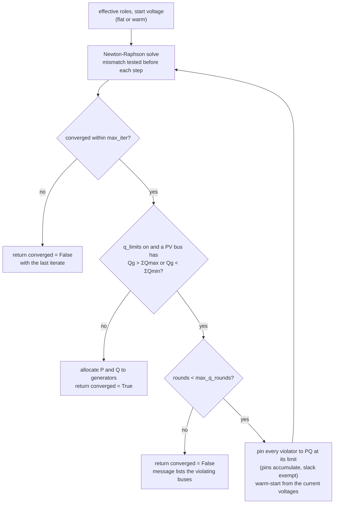

# Power flow

`mambo_power.pf` holds the power-flow solvers. Public entry points take a `Network` and return
a typed [result](results.md) with provenance; the array-level solvers work on
[`NetworkArrays`](numerics.md) only and return plain positional arrays. The network is never
modified.

| Entry point | Returns |
| --- | --- |
| `pf.solve_dc(net)` | `DcPowerFlowResult` |
| `pf.dc.solve(arr)` | `DcSolution` (positional, pu) |
| `pf.solve_ac(net, *, options=None)` | `AcPowerFlowResult` |
| `pf.ac_newton.newton(arr, roles, opts, v0=None)` | `AcSolution` (positional, pu) |

Runnable scripts: [`02_ac_power_flow.py`](../examples/index.md#2-ac-power-flow),
[`03_dc_power_flow.py`](../examples/index.md#3-dc-power-flow),
[`05_roles_and_islands.py`](../examples/index.md#5-roles-and-islands).

## DC power flow

The DC model is the lossless linearisation: flat voltage magnitudes, small angle differences,
resistance and line charging ignored. It is exact for what it models and is the workhorse of
PTDF-based contingency analysis and DC optimal power flow.

### Formulation

With \(B'\) the DC susceptance matrix, \(B_f\) the from-side flow matrix, and the
phase-shifter injections \(P_\text{shift} = C_{ft}^\top P_{f,\text{shift}}\),
\(P_{f,\text{shift}} = -b \odot \phi\) (all from [numerics](numerics.md#dc-susceptance-matrices-bbus-bf-p_shift)),
the declared net injection per bus in per unit is

\[
P_\text{bus} = P_\text{gen} - P_\text{load} - G_\text{shunt}
\]

where \(G_\text{shunt}\) is the shunt conductance consumption at 1.0 pu. The angles solve the
linear system with the slack row and column removed and the slack angle fixed at zero:

\[
B'[\text{keep},\text{keep}]\;\theta[\text{keep}] = (P_\text{bus} - P_\text{shift})[\text{keep}],
\qquad \theta_\text{slack} = 0 .
\]

Flows and realised injections follow:

\[
P_f = B_f\,\theta + P_{f,\text{shift}}, \qquad P_t = -P_f, \qquad
P_\text{inj} = B'\,\theta + P_\text{shift} .
\]

\(P_\text{inj}\) equals \(P_\text{bus}\) on every non-slack bus; at the slack it is whatever
closes the balance (lossless, so \(\sum P_\text{inj} = 0\)). These are exactly MATPOWER
`rundcpf`'s steps — which pandapower's `rundcpp` copies — and the parity test asserts equality
with `rundcpp` within 1e-9 on every fixture including case300.

The reduced system is factorised with `scipy.sparse.linalg.splu`, the same backend as the PTDF
builder and the AC solver; the provenance records `solver = "scipy.sparse.linalg.splu"`.

### Slack convention

The slack-bus balance goes **entirely to the first in-service generator at the slack bus**;
every other generator keeps its declared dispatch. This is MATPOWER's rule
(`gen(on(refgen(1)), PG) += ...`) and the number pandapower reports on `res_ext_grid`. Bus-level
generation is therefore engine-independent; the per-generator split is this documented
convention. If the slack bus has no in-service generator the balance cannot be closed;
naming that situation is the job of [effective roles](#effective-bus-roles).

### Errors

`pf.dc.solve` raises `UnsolvableNetworkError` when a branch has `x == 0` (susceptance
undefined — a valid network the DC numerics cannot solve, not a solver bug) or `ValueError`
when the reduced \(B'\) is singular or yields non-finite angles — an islanded bus set that
slipped past validation. Through the [jobs API](jobs.md) these become structured failures
(`UNSOLVABLE_NETWORK` and `INTERNAL` respectively).

### The result

`solve_dc` returns a `DcPowerFlowResult` in MW keyed by ids: `vm_pu = 1.0` on every bus
(MATPOWER `rundcpf` sets `VM = 1`), all reactive columns 0, `converged = True` always,
`p_to_mw = -p_from_mw` on every branch, `loading_pct` from the from-side flow over
`rating_mva` or `None` when unrated. `role_effective` reports the
[effective role](#effective-bus-roles) of each bus. See [Results](results.md).

```python
from mambo_power import pf
from mambo_power.io import matpower

net = matpower.load("fixtures/matpower/case14.m")
result = pf.solve_dc(net)
print(result.provenance.kind, result.provenance.solver, result.converged)
print(result.buses[1].va_deg, result.branches[0].p_from_mw, result.generators[0].p_mw)
```

```text
pf.dc scipy.sparse.linalg.splu True
-5.01201116593048 147.83859555890945 218.99999999999983
```

Positional use, when you already have arrays:

```python
from mambo_power.numerics import NetworkArrays
from mambo_power.pf import dc

arr = NetworkArrays.from_network(net)
sol = dc.solve(arr)  # DcSolution: theta_rad, p_from_pu, p_inj_pu, gen_p_pu
print(sol.theta_rad[arr.slack], sol.p_from_pu[0] * arr.base_mva)
```

```text
0.0 147.83859555890945
```

## AC power flow

`pf.solve_ac` is a sparse polar Newton-Raphson solver with pandapower-semantics reactive-limit
enforcement. It matches pandapower `runpp` at machine precision on every bundled fixture
([verification](#verification)) and solves case300 from a flat start in a few hundredths of a
second.

### API

```python
from mambo_power import pf
from mambo_power.io import matpower

net = matpower.load("fixtures/matpower/case118.m")
result = pf.solve_ac(net, options=pf.AcOptions(init="flat"))
print(result.converged, result.iterations, result.q_limit_rounds, f"{result.max_mismatch_mva:.1e}")
print([(g.bus, g.q_limited) for g in result.generators if g.q_limited != "none"])
```

```text
True 7 1 8.6e-12
[('bus-19', 'min'), ('bus-32', 'min'), ('bus-34', 'min'), ('bus-92', 'min'), ('bus-103', 'max'), ('bus-105', 'min')]
```

`solve_ac(net, *, options: AcOptions | None = None) -> AcPowerFlowResult`. `AcOptions` is a
frozen pydantic model (`extra="forbid"`), which is also what the [jobs API](jobs.md) validates
`options` against for `kind="pf.ac"`; the options as run are stamped into
`result.provenance.options`.

| Option | Default | Meaning |
| --- | --- | --- |
| `tol` | `1e-8` | Convergence tolerance on the ∞-norm of the per-unit power mismatch (MATPOWER `pf.tol`; pandapower's `tolerance_mva` is the same pu quantity). Must be > 0. |
| `max_iter` | `20` | Newton iterations per solve (per Q-limit round). |
| `q_limits` | `True` | Enforce generator reactive limits (see [below](#q-limit-enforcement-pandapower-semantics-decision-d2)). |
| `max_q_rounds` | `10` | Maximum number of re-solves after pinning. |
| `init` | `"auto"` | `"auto"` warm-starts from `Bus.vm_pu` / `Bus.va_deg` when **every** in-service bus carries both, else flat; `"flat"` forces 1.0∠0 at PQ buses with PV and slack buses at their setpoint. |

The result adds three diagnostics to the common tables: `iterations` (Newton iterations
**summed over every Q-limit round**), `q_limit_rounds` and `max_mismatch_mva` (the final
∞-norm, in MVA). A solve that does not converge is reported through `converged = False` with
the last iterate — never raised; through the jobs API it is `status="ok"` with
`converged=False`.

```python
stuck = pf.solve_ac(net, options=pf.AcOptions(init="flat", max_iter=1))
print(stuck.converged, stuck.iterations, f"{stuck.max_mismatch_mva:.3f} MVA")
```

```text
False 1 82.538 MVA
```

The only exceptions that escape `solve_ac` are `NoSlackGeneratorError` (a slack bus without an
in-service generator, from [effective roles](#effective-bus-roles)) and `ValueError` for a
singular admittance matrix.

### Formulation: polar Newton-Raphson

With \(Y\) the bus admittance matrix, \(V = |V| e^{j\theta}\) and the specified net injections
\(S^\text{spec} = (P_\text{gen} - P_\text{load}) + j(Q_\text{gen} - Q_\text{load})\) in per
unit (shunts live in \(Y\)), the mismatch is

\[
\Delta S = V \odot (Y V)^*  - S^\text{spec}, \qquad
f(x) = \begin{bmatrix}
\Re\{\Delta S\}_{\text{pv} \cup \text{pq}} \\
\Im\{\Delta S\}_{\text{pq}}
\end{bmatrix},
\qquad x = \begin{bmatrix} \theta_{\text{pv} \cup \text{pq}} \\ |V|_\text{pq} \end{bmatrix} .
\]

Each iteration solves \(J\,\Delta x = -f\) with the Jacobian assembled from the sparse partial
derivatives of MATPOWER's `dSbus_dV` (polar form):

\[
\frac{\partial S}{\partial |V|} = \operatorname{diag}(V)\,\bigl(Y \operatorname{diag}(V/|V|)\bigr)^* + \operatorname{diag}(YV)^*\operatorname{diag}(V/|V|),
\qquad
\frac{\partial S}{\partial \theta} = j\,\operatorname{diag}(V)\,\bigl(\operatorname{diag}(YV) - Y\operatorname{diag}(V)\bigr)^*
\]

\[
J = \begin{bmatrix}
\Re\{\partial S/\partial\theta\}_{\text{pvpq},\,\text{pvpq}} & \Re\{\partial S/\partial|V|\}_{\text{pvpq},\,\text{pq}} \\
\Im\{\partial S/\partial\theta\}_{\text{pq},\,\text{pvpq}} & \Im\{\partial S/\partial|V|\}_{\text{pq},\,\text{pq}}
\end{bmatrix}
\]

factorised with `scipy.sparse.linalg.splu` every iteration. The mismatch is tested **before**
each step, so a start that already satisfies \(\|f\|_\infty \le \text{tol}\) reports **zero**
iterations (MATPOWER's convention; MATPOWER and pandapower use a strict `<`, which is
immaterial at 1e-8). The loop stops with `converged = False` after `max_iter` updates, on a
singular Jacobian, or when an update produces a non-finite voltage.

**Start.** Flat: \(|V| = 1, \theta = 0\) at PQ buses, \(|V| = v_\text{set}\) (the effective
setpoint) and \(\theta = 0\) at PV and slack buses. Warm (`init="auto"`): the buses' stored
`vm_pu` / `va_deg` with PV and slack magnitudes replaced by the setpoint; the slack keeps its
stored angle, so angles are slack-relative only for flat starts.

**Generator allocation** (MATPOWER `pfsoln`; pandapower `pypower/pfsoln.py:109-141` is a
verbatim copy). Every generator keeps its dispatch except the first in-service generator at
the slack bus, which absorbs the slack balance — the same rule DC uses. The bus reactive total
is split among the bus's in-service generators proportionally to each one's reactive range
(equally when every range is zero), so a pinned bus's generators sit exactly at their
individual limits.

### Q-limit enforcement (pandapower semantics, decision D2)

The implementation follows pandapower 3.3.0 `pf/run_newton_raphson_pf.py:182-249`
(`_run_ac_pf_with_qlims_enforced`), itself a port of MATPOWER `runpf.m:366-440` with
`pf.enforce_q_lims = 1`. After every **converged** Newton solve the reactive generation per
bus is \(Q_g = \Im\{V (YV)^*\} + Q_\text{load}\); every bus still PV whose \(Q_g > \sum Q_\max\)
or \(Q_g < \sum Q_\min\) (aggregate over its in-service generators) is converted to PQ with
\(Q^\text{spec} = Q_\text{limit} - Q_\text{load}\):

- the comparison is **strict** (pandapower `:199-200`; MATPOWER adds a 5e-6 `opf.violation`
  slack, pandapower does not);
- all violators of a round are converted together (`enforce_q_lims=1`, simultaneous), and the
  next solve warm-starts from the current voltages;
- pins **accumulate — a pinned bus is never restored to PV** (`limited = r_[limited, mx]`,
  `:235`; the spec rejects the PQ→PV restore, which has no oracle);
- the slack bus is never converted (`setdiff1d(changed_gens, ref)`, `:227`; MATPOWER's
  re-slack when the slack generator hits a limit is not implemented);
- the loop ends when a converged solve shows no new violation; if violations persist after
  `max_q_rounds` re-solves the result carries `converged = False` and a message listing the
  buses (pandapower raises `LoadflowNotConverged` instead);
- a Newton solve that fails to converge ends the loop at once without pinning — pinning from
  an unconverged state has no oracle.

Pinned buses report the limit itself (as pandapower's `fixedQg` restore does) and each of their
generators' `GenResult.q_limited` is `"min"` or `"max"`; `AcPowerFlowResult.q_limit_rounds`
counts the re-solves. The parity test requires the **same set of pinned buses on the same
side** as pandapower on every fixture where limits bind. Limits are aggregated per bus, as the
spec says; pandapower tests per generator — the two coincide whenever a bus's generators have
non-zero ranges, which holds on every bundled fixture (one generator per bus).



### Warm start

Copy a solved state into the buses and `init="auto"` picks it up; a start already inside
tolerance is accepted with zero iterations:

```python
off = pf.solve_ac(net, options=pf.AcOptions(init="flat", q_limits=False))
for bus, row in zip(net.buses, off.buses, strict=True):
    bus.vm_pu, bus.va_deg = row.vm_pu, row.va_deg
again = pf.solve_ac(net, options=pf.AcOptions(q_limits=False))  # init="auto"
print(again.iterations, again.q_limit_rounds, again.converged)
```

```text
0 0 True
```

With Q-limits on, a previously pinned bus is PV again at the start (its magnitude snaps back to
the setpoint), so one re-pin round is needed; from the shipped MATPOWER columns `"auto"` needs
2–6 iterations on the upstream fixtures and reaches the same fixed point as a flat start.

### Effective bus roles

The declared `Bus.type` is the input; the role the solver uses is derived by
`numerics.effective_roles(arr)`, the single derivation site (W3):

| Situation | Effective role |
| --- | --- |
| PV bus with at least one in-service generator | PV, setpoint from the generators |
| PV bus with **no** in-service generator | **PQ** (MATPOWER `bustypes`, pandapower `build_gen` agree) |
| Slack bus with no in-service generator | raises `NoSlackGeneratorError` (no MATPOWER-style re-slack) |
| Several in-service generators on one bus | setpoint is the **last** one's `v_set_pu` (MATPOWER `runpf.m:296`); a `SetpointConflictWarning` names the bus, the generators and both values when they differ by more than 1e-9 pu |

`NetworkArrays.bus_type` keeps the declared roles; both solvers consume the effective ones, and
every `BusResult.role_effective` reports the role the bus was actually solved with (for AC,
after Q-limit pinning). pandapower's *converter* picks the first generator's setpoint, so on
the `case14_roles` fixture the two disagree by design at bus 2 — the warning is about exactly
that. See [`05_roles_and_islands.py`](../examples/index.md#5-roles-and-islands).

### Islands (decision D1)

The AC solver assumes the in-service subset is connected — the model guarantees it. Files
with islands are repaired by the importer (buses unreachable from the slack and their
elements are deactivated, with an `ISLAND_DEACTIVATED` issue) before the network is
validated; see [File formats › Islands](formats.md#islands) and
[`model.repair_islands`](model.md#import-issues-and-island-repair).

### Verification

pandapower `runpp(init="flat", tolerance_mva=1e-8, trafo_model="pi", enforce_q_lims=…)` is
the primary oracle (bands 1e-6 pu, 1e-4 deg, 1e-4 MVA); MATPOWER's stored VM/VA columns are
the secondary check at 2e-3 pu / 0.5 deg with a per-fixture exclusion list. Measured on the
wave head (`tests/parity/test_ac_vs_pandapower.py`, `test_ac_vs_matpower_stored.py`):

| Fixture | Q-limits | NR iterations | Rounds | Pinned buses (side) | max Δ\|V\| vs runpp | max Δθ | max Δflow | Stored-column residual (VM, bus) |
| --- | --- | --- | --- | --- | --- | --- | --- | --- |
| case14 | on | 4 | 0 | — | 8.9e-16 pu | 2.8e-14° | 4.1e-13 MVA | 1.33e-3 (bus 4) |
| case_ieee30 | on | 6 | 1 | 2 (max) | 1.1e-15 pu | 6.4e-14° | 7.1e-13 MVA | 6.1e-4 (bus 16); bus 3 excluded |
| case57 | on | 4 | 0 | — | 5.6e-15 pu | 1.7e-13° | 2.1e-12 MVA | 8.7e-4 (bus 32); 14, 46, 47 excluded |
| case118 | on | 7 | 1 | 19, 32, 34, 92, 105 (min); 103 (max) | 8.9e-16 pu | 2.0e-13° | 6.3e-12 MVA | 9.9e-4 (bus 105); 17, 30, 38, 68 excluded |
| case300 | off | 5 | 0 | — | 3.2e-14 pu | 4.3e-12° | 1.3e-10 MVA | 8.5e-3; 11 of 300 buses beyond 2e-3 (not gated) |
| case300 | on | 7 | 1 | 10, 20, 156, 170, 171, 236, 7003, 7055, 7062, 9002 (all max) | 4.0e-14 pu | 4.3e-12° | 9.2e-11 MVA | — |

"NR iterations" is the total across rounds (case118: 3 + 4 after pinning). The stored-column
bands were ratified at 2e-3 pu / 0.5 deg because the stored solutions are CDF-era solved
points that no solver reproduces to file precision — case14 bus 4 is 1.33e-3 pu off for
pandapower and for us alike; the measured residual is pinned in the test so it cannot drift.
The excluded buses are the ones the reference-quality gate (5 MVA mismatch of the stored state)
flags in each file. case30's stored state is flat, so it is a self-consistency fixture only.
The case118 negative pair for Q-limits: bus 103 is stored at 1.001 pu; with limits off it sits
at its 1.01 setpoint (9e-3 off, outside the band), with limits on at 1.00071.

**Timing (AC-7).** case300, Q-limits off, flat start, first call in a fresh interpreter
(arrays, Ybus, five sparse LU factorisations, result construction): **0.029 s cold, 0.018 s
warm** on the development machine (Windows 11, Python 3.12). The contracted surface is the CI
ubuntu 3.12 job, where `tests/parity/test_ac_timing.py` asserts < 1.0 s and a dedicated step
prints the measured cold and warm seconds into the job log; the figure above is not a CI
measurement.

## Choosing between DC and AC

| | DC | AC |
| --- | --- | --- |
| Models | active power, angles | active + reactive power, magnitudes + angles |
| Losses | none | yes |
| Solve | one sparse linear solve | Newton iterations, Q-limit rounds |
| Always converges | yes (if connected) | no — check `converged` |
| Use for | screening, PTDF/LODF, DC-OPF, markets | voltage studies, AC feasibility check after DC-OPF |

[`03_dc_power_flow.py`](../examples/index.md#3-dc-power-flow) puts the two side by side on
case300: the DC flows are within a few MW of AC on most branches and blind to the ~400 MW of
losses.
