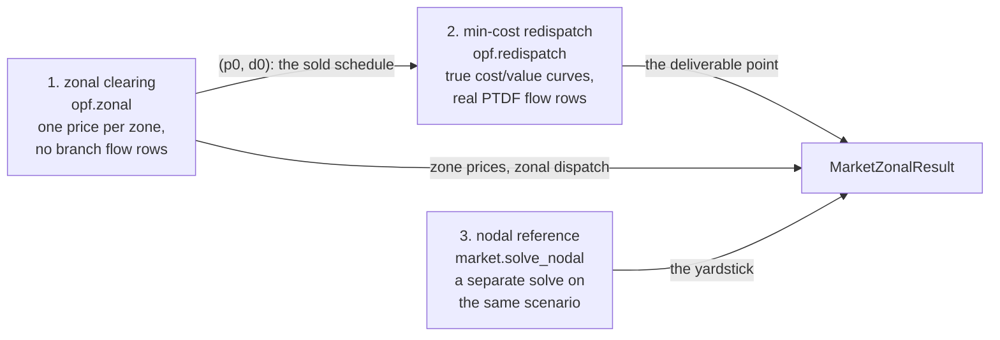

# Zonal market and redispatch

`market.solve_zonal` clears a market at **zonal** granularity — one price per zone, the
intra-zone grid ignored — then finds the cheapest way to move that schedule onto the real
network, and finally measures the pair against the nodal optimum
[`market.solve_nodal`](market.md) computes. It is the European day-ahead shape: a coarse market
that clears fast on a simplified grid, followed by a transmission operator's redispatch that
makes the answer physically deliverable.

The interesting content of this page is not any one of those three solves. It is their
*relationship*, and the fact that the relationship is a theorem rather than a measurement.

| Entry point | Returns |
| --- | --- |
| `market.solve_zonal(scenario, options=None)` | `MarketZonalResult` |

Runnable script: [`11_zonal_redispatch.py`](../examples/index.md#11-zonal-redispatch).

## Three solves, one result

`solve_zonal` runs three solves in order, and the result carries all three layers.



1. **Zonal clearing.** `Bus.zone` becomes solver input: one balance row per zone, one bounded
   exchange variable per tied zone pair, and *no* branch flow rows at all. This is the market
   participants actually clear in, and its schedule is generally **not** something the real
   network can carry.
2. **Min-cost redispatch.** From that schedule, move each generator and each bid load up or
   down — at their true costs and bid values — until every branch respects its rating. This is
   the operator's action after the market closes.
3. **The nodal reference.** `market.solve_nodal` on the *same* scenario. It is a genuinely
   separate solve rather than a quantity inferred from step 2, because step 2's agreement with
   it is the thing the wave's tests assert, and inferring the reference from the thing under
   test would make that assertion vacuous.

!!! warning "`generators` is the schedule that was *sold*, not the one that is delivered"
    `MarketZonalResult.generators` and `.loads` carry the **zonal clearing's** schedule — what
    the market sold before the network was consulted. The dispatch the network actually delivers
    is in `.generators_final` and `.loads_final`.

    This is a trap because the name is shared across a closed union: on
    [`MarketNodalResult`](market.md) and on every power-flow result, `generators` *is* the
    delivered dispatch, and code that switches on result type sees the same attribute mean two
    different things. Anything that settles, reports or plots "the dispatch" wants the `_final`
    pair here. On the case30 case built below every one of the six generators moves between the
    two layers, 21.9 MW of instructed-up volume in total — silently reading the wrong one is
    not a rounding error.

## What the comparison measures — and what it does not

The redispatch objective is the **true** welfare function (generator cost curves and load bid
curves as written, not a linear rate anchored at the zonal point) evaluated over the nodal
problem's exact feasible set. Two consequences follow immediately:

!!! abstract "The redispatched point *is* the nodal optimum"
    Not "close to" it, and not "no worse than" it. Redispatch minimises the same objective over
    the same feasible set as `market.solve_nodal`, so it lands on the same optimum from **any**
    feasible starting point. `MarketZonalResult.welfare_gap` is therefore `0` by construction —
    it is a check on the chain, not a measurement of the zonal design.

That is what makes the comparison meaningful. If redispatch were a heuristic, a nodal-vs-zonal
number would mix two different things: how much the zonal *design* costs, and how badly the
*redispatch algorithm* happened to land. Here the second term is exactly zero, so what
`redispatch_payment` reports is the cost of the market design alone — the volume the operator
has to move, and what moving it is worth.

The obvious alternative — settle redispatch at each unit's marginal rate *at the zonal point*,
rather than on its true curve — was tried and rejected. An anchored rate carries a systematic
over-curtailment bias: because a curtailed load's compensation is priced at a rate frozen before
the move, the LP will happily curtail demand to reach a lower *reported* generation cost while
destroying welfare. It also breaks the theorem above, since the objective is then no longer the
function the nodal problem optimises, and every figure on this page would become a measurement of
the redispatch heuristic rather than of the market design.

Agreement between the redispatched point and `solve_nodal` is asserted to a **tolerance**, never
bitwise. They are two different LPs handed to the solver, and the same formulation can land on
different last bits on different platforms.

## Zones and corridors

The zone partition is **read**, never derived. `Bus.zone` and `Network.zones` have been in the
schema since the first wave and every MATPOWER import populates them from the `ZONE` column;
this is where they finally become solver input. A bus with no zone is an error rather than a
default, because that bus's load and generation must enter *some* zone's balance row and
choosing one for you would clear a market for a network you did not describe.

Corridor capacities are **not** model data. They are supplied per solve:

```python
options = market.MarketZonalOptions(
    corridors=[
        market.CorridorLimit(zone1="1", zone2="2", cap_mw=1.524),
        market.CorridorLimit(zone1="1", zone2="3", cap_mw=16.577),
    ]
)
```

A transfer capacity between two zones is administratively negotiated data. No branch rating
determines it uniquely — a cut-set sum is one defensible convention among several — and no
bundled fixture carries it, so a first-class model entity would be inventing committed data. It
lives on the options object instead, where the caller who knows the number supplies it.

`CorridorLimit` is a row model rather than a `{(zone1, zone2): cap}` mapping for a mechanical
reason: pydantic serialises a tuple dict key to the string `"1,2"` and then refuses to validate
it back, so a mapping-shaped options model could not round-trip through JSON — and every
[jobs](jobs.md) request form must. The mapping is the shape the array-level builder takes, and
`MarketZonalOptions.corridor_map()` produces it on the way there.

A zone pair absent from the list has no corridor at all and cannot exchange anything. That is a
stronger statement than a corridor of capacity `0`, and the difference is not only cosmetic —
see [Deleting a corridor is not the copper plate](#deleting-a-corridor-is-not-the-copper-plate).

## The zonal LP

The nodal LP carries one system-wide balance row plus one PTDF flow-limit row per branch. The
zonal LP replaces **both**: one balance row per zone, and one bounded exchange variable per tied
zone pair. Zone \(z\)'s row is

\[
\sum_{g \in z} p_g \;-\; \sum_{d \in z} p_d
\;+\; \sum_{c \,\to\, z} f_c \;-\; \sum_{c \,\leftarrow\, z} f_c
\;=\; \text{fixed load}_z + \text{shunt}_z ,
\]

and every corridor's capacity enters as a plain **variable bound**, \(-\text{cap} \le f_c \le
+\text{cap}\), not as a row. There are deliberately no intra-zone flow rows and no flow rows at
all; no PTDF matrix is ever built. Each zone is a copper plate internally, and the only thing
limiting where power comes from is how much a corridor can carry. A solve that consulted the
PTDF would be modelling something else.

The balance rows come from the same `_balance_row` helper the nodal and multiperiod builders
use, with the same `+1`/`-1` convention — handed each zone's own column sets and each zone's own
fixed right-hand side. The piecewise-linear epigraph and hypograph rows are reused verbatim too,
and cost/bid extraction with both convexity guards comes from a single shared extractor, so no
builder in this package can get them subtly different — none of them implements them.

Column layout is two tiers, mirroring the multiperiod builder: `[gen | demand | corridor]`, then
the free PWL `[cost_g | val_d]` columns. The quadratic Hessian covers the dispatch columns only
and is passed before the corridor columns are appended — a corridor column is a transfer, never
a cost, so it has no quadratic term to contribute.

### Corridor sign convention

A corridor is keyed by an **unordered** zone pair. The builder normalises each key to sorted
order (\(z_1 < z_2\)) and then uses **positive means \(z_1 \to z_2\)**: the corridor's column
enters zone \(z_1\)'s balance row as a withdrawal and zone \(z_2\)'s as an injection, with the
symmetric bounds above.

So a **negative** corridor flow means that corridor is carrying power the other way, and it
binds at `-cap` in that direction. On the case30 example below, corridor `(2, 3)` sits at
`-19.456 MW` — zone 3 exporting to zone 2 at full capacity — while corridor `(1, 2)` sits at
`+1.524 MW`. Both are binding; only the sign differs.

### Zone prices

A zone's clearing price is its own balance row's dual — the per-zone counterpart of the nodal
energy price, and the single source of truth for the concept. It is emphatically **not** an
average or a rollup of the bus LMPs in `MarketZonalResult.buses`: those are the *final*,
post-redispatch nodal prices, and the whole content of a nodal-versus-zonal comparison is that
the two disagree.

Two zones joined by a corridor that does not bind necessarily price **identically**. Summing
their two balance rows cancels the exchange column entirely, collapsing them into the single
system-wide row the nodal builder already writes. Prices separate exactly where a corridor
binds, and by exactly that corridor's own capacity shadow price.

This has a consequence worth internalising before reading any zonal result: **the number of
distinct prices is a property of which corridors bind, not of how many zones you drew.** case30
has three zones and produces two distinct prices *to solver precision*, because zones 1 and 3 are
joined by a slack corridor whose interior exchange column forces their two balance duals equal.

The qualifier is not a hedge, it is the literal state of the numbers: the three prices come back
as `3.759145`, `3.880504` and `3.759147` \$/MWh, so `len({z.price for z in result.zones})` is
**3**, not 2. Zones 1 and 3 agree to about `2e-6` \$/MWh — equal as far as the model is
concerned, and not equal as far as `==` or `set()` is concerned. Compare zone prices with a
tolerance, never by identity.

### The corridor capacity price

`ZonalDuals.corridor_cap` is the shadow price of the corridor's *capacity*: how much the
objective improves per extra MW of cap, in whichever direction the corridor is actually binding.
It is **non-negative by construction** and exactly `0` on a slack corridor, regardless of which
way the flow runs.

That non-negativity is deliberate work, not an accident of the solver. HiGHS reports a bounded
column's reduced cost with a sign that depends on which bound is active — negative at the upper
bound of a minimisation, positive at the lower — so the raw value for a corridor binding in the
\(z_2 \to z_1\) direction comes back negative. Since relaxing the *capacity* moves the active
bound outward either way, the capacity price is that reduced cost's **magnitude**.

Where a corridor binds and the zones on either side both price at an interior marginal unit,
this equals \(|\lambda_{z_2} - \lambda_{z_1}|\) — an identity the tests assert, not one the
field is computed from.

!!! note "The capacity price is an array-level quantity"
    `MarketZonalResult` carries no corridor rows: it reports zone prices, both dispatch layers,
    the deltas, per-branch flows and duals, per-bus LMPs and the three figures. To read a
    corridor's own flow and capacity price, call `opf.zonal.zonal_dc_opf` directly and read
    `ZonalSolution.corridor_flow_mw` / `ZonalDuals.corridor_cap`. At the market level the same
    information is visible as the price separation between the zones the corridor joins.

### Deleting a corridor is not the copper plate

A natural-looking way to build a "no congestion" control case is to remove the corridors and
check that all zones price the same. It does the opposite.

With no exchange column, the zones' balance rows **decouple**: each zone must supply itself, and
the prices separate as far as they can possibly go. Only lifting the *cap* — leaving the column
in place, unbounded — collapses the rows into one and produces a single price. On the worked
example below, capping the corridor at 20 MW and deleting it outright both give prices
`10 / 50`; only the lifted cap gives `10 / 10`.

The trap has a second edge. A control case built by *removing* the corridor would also pass an
engine with the corridor column's sign flipped, because there would be no column left to have a
sign. Copper-plate controls in this package therefore lift the cap, never delete the entry.

### Phase shifters are omitted from the zonal balance rows

The nodal builder leaves phase-shift injections out of its single balance row because they
cancel system-wide by construction. Per **zone** they do not: a phase shifter on a tie line
injects in one zone and withdraws in the other.

They are omitted here anyway, and deliberately. A phase shifter is a device for steering flow on
a branch model this LP does not have. Whatever inter-zone transfer it would produce is already,
and entirely, what the corridor variable represents — bounded by the corridor's own capacity
rather than by a device setting. Folding a phase-shift injection into a zone's fixed right-hand
side would instead *force* a transfer the zonal abstraction has no basis for, on top of the free
one. At one zone the omission is exactly the nodal builder's own, which is what keeps the
single-zone degenerate case exact.

## The redispatch LP

Given the zonal operating point — a per-generator dispatch \(p^0\) and a per-bid-load served
demand \(d^0\) — redispatch finds the cheapest move to a point the real network can carry. The
move is four nonnegative column families, **both sides of the market**:

\[
\Delta p^{+}_g \in [0,\; p^{\max}_g - p^0_g], \qquad
\Delta p^{-}_g \in [0,\; p^0_g - p^{\min}_g],
\]

with \(\Delta d^{+}\) and \(\Delta d^{-}\) mirroring them for each bid load. The final point is
\(p_g = p^0_g + \Delta p^{+}_g - \Delta p^{-}_g\), and because the bounds are the *shifted*
generator and load bounds, that point ranges over precisely the box the nodal problem has — no
larger and no smaller. That is half of why the theorem above holds; the other half is the
objective,

\[
\min \; \sum_g \mathrm{cost}_g\bigl(p^0_g + \Delta p^{+}_g - \Delta p^{-}_g\bigr)
\;-\; \sum_d \mathrm{value}_d\bigl(d^0_d + \Delta d^{+}_d - \Delta d^{-}_d\bigr),
\]

the true welfare function at the *final* quantity. Demand moves in both directions on purpose:
curtailment is not the only redispatch action, and a load whose zonal clearing left it
under-served can be restored.

The zonal point itself is fixed data and moves to the right-hand side — the balance row's RHS
gains \(-\sum_g p^0_g + \sum_d d^0_d\), and each flow-limit row's constant gains that point's own
PTDF contribution. This is the same fold-every-fixed-contribution-into-the-constant convention
the nodal builder already uses for fixed load and shunts.

### Reported deltas are netted

The objective depends on each pair only through \(u = \Delta^{+} - \Delta^{-}\), so
\((\Delta^{+} + \alpha,\; \Delta^{-} + \alpha)\) is exactly as optimal for any feasible
\(\alpha\). Which split the solver returns is an implementation accident, not a modelling fact.

`RedispatchSolution` and `MarketZonalResult` therefore report the canonical representative —
`up = max(u, 0)`, `down = max(-u, 0)` — so that `final == p0 + up - down` and `up * down == 0`
hold exactly, on every platform, whatever vertex the solver picked. The raw columns are never
surfaced.

**The two sides carry different field names, and only the generator side is `up`/`down`.** A
generator is instructed up or down; a load is *curtailed* or *restored*, which is the same
algebra under a name that says what happened to a consumer. Writing `delta_up_mw` on a load row
raises `AttributeError`:

| Layer | Generator side | Load / demand side |
| --- | --- | --- |
| `MarketZonalResult.redispatch_generators` (`GenRedispatchResult`) | `delta_up_mw`, `delta_down_mw` | — |
| `MarketZonalResult.redispatch_loads` (`LoadRedispatchResult`) | — | `delta_restore_mw`, `delta_curtail_mw` |
| `opf.redispatch.RedispatchSolution` (arrays) | `delta_up_mw`, `delta_down_mw` | `demand_delta_up_mw`, `demand_delta_down_mw` |

So the identity reads `p_final == p_zonal + delta_up_mw - delta_down_mw` on a generator row and
`d_final == d_zonal + delta_restore_mw - delta_curtail_mw` on a load row. Restoring demand is the
`up` direction: a load served *above* its zonal schedule has a positive `delta_restore_mw`.

Two nonnegative fields rather than one signed one, for the same reason storage gets separate
charge and discharge columns: a signed net number erases which direction was actually
instructed, and "instructed up" and "instructed down" are different products a real redispatch
mechanism settles differently.

### Piecewise-linear participants get one linking column

The epigraph encoding needs the cost rows to see **one** column carrying the final quantity, and
here the final quantity spans two. So a PWL participant — and only a PWL participant — gets one
extra column \(q\), bounded by its own `[p_min, p_max]`, tied to its delta pair by

\[
q + \Delta^{-} - \Delta^{+} = p^0 .
\]

That is an ordinary balance row, not a new row family: the helper is pure algebra over LP column
indices and does not care what a column represents. The epigraph and hypograph builders are then
called verbatim with \(q\) where the nodal builder passes its dispatch column. A quadratic
participant has no \(q\) at all — its curve expands into a linear column cost plus a 2x2 Hessian
block coupling the pair, \(2 c_2 \begin{bmatrix} 1 & -1 \\ -1 & 1\end{bmatrix}\).

## Three figures, and why they are three

`MarketZonalResult` reports three separate numbers. They answer three different questions and
none is derived from another.

| Field | It is | Definition |
| --- | --- | --- |
| `redispatch_payment` | a **settlement** figure | `[cost(final) − cost(zonal)] + [value(d_zonal) − value(d_final)]` |
| `welfare_gap` | an **exactness** row | `welfare(nodal) − welfare(final)`, `0` by the theorem |
| `generation_cost_gap` | a **diagnostic** | `cost(zonal) − cost(nodal)` |

`redispatch_payment` is what the operator pays to move from the sold schedule to the deliverable
one: the extra generation cost, plus compensation to curtailed load at its own bid value (a load
*restored* above its zonal schedule contributes negatively, paying back at the same value).
Algebraically it is exactly `welfare(zonal) − welfare(final)`, which is why it is non-negative
wherever the zonal LP is a relaxation of the nodal one — it is the welfare the zonal clearing
promised and the network could not deliver.

#### When `redispatch_payment` goes negative

"Wherever the zonal LP is a relaxation" is a real condition, not a formality, and this page's own
worked variations break it. The zonal problem is a relaxation exactly when its feasible set
*contains* the nodal one — when no corridor cap restricts an exchange more tightly than the
network would have restricted it anyway. Where that fails the zonal clearing is welfare-*worse*
than the nodal optimum, the redispatch improves welfare rather than paying for it, and the
settlement figure runs inward: the operator collects.

Two ordinary ways to land there:

- **Corridor caps set tighter than the network can carry.** A negotiated NTC is normally set
  *below* thermal capability, so this is the common regime in practice, not an exotic one.
- **Islanded zones** — corridors omitted, or capped at `0`. With no exchange column at all the
  zonal problem is strictly more constrained than the nodal one in every direction at once. This
  is the same trap as *[Deleting a corridor is not the copper
  plate](#deleting-a-corridor-is-not-the-copper-plate)*, seen from the settlement side.

On the three-bus fixture below, omitting the corridors (or capping at `0`) gives
`redispatch_payment` of **−800.00 \$/h** against **+400.00 \$/h** with the cap lifted. On case30 with
branch ratings loosened 20x and every corridor capped at `0`, it is **−11.053 \$/h**.

The condition is a *comparison*, though, so neither half is a rule of thumb on its own. On the
case30 case the runnable example builds — ratings derived at 1.2x the base-case flow, which is a
very tight network — even islanding the zones still leaves the zonal problem the looser of the
two, and the payment stays positive at **+3.805 \$/h**. Tight caps make the payment negative only
when the caps are tight *relative to the network*.

If your application needs the figure to be a payment in the accounting sense, assert the sign
rather than assuming it, and treat a negative value as the diagnostic it is: the corridor set,
not the network, is what bound the market.

`welfare_gap` is the exactness row. A nonzero value means the chain is wrong, not that zonal
clearing is expensive.

!!! warning "`generation_cost_gap` is not sign-constrained — do not read it as a score"
    The relaxation argument orders **welfare**, not generation cost. A zonal clearing that
    serves less demand, or less valuable demand, can burn strictly less fuel than the nodal
    optimum while being welfare-worse.

    On the case30 example below `generation_cost_gap` is **−14.637 \$/h**: the zonal clearing is
    genuinely cheaper to fuel than the nodal optimum. It is not therefore better. It is serving
    the same demand from a dispatch the network cannot carry, and `redispatch_payment` of
    **+14.637 \$/h** is what un-carrying it costs. Reading the negative number as "zonal beat
    nodal" is precisely the error the three fields are separated to prevent.

    (The two figures being exact negatives of each other on this fixture is not a coincidence,
    and it is not confined to this fixture either — see *The three figures are two independent
    quantities plus a check* immediately below.)

The third figure's definition deserves a note, because the obvious alternative is empty. Defining
it as `cost(final) − cost(nodal)` would make it identically zero — the same theorem that zeroes
`welfare_gap` zeroes that difference too, so it would ship as a second copy of the exactness row
rather than a diagnostic. The quantity that survives is the **zonal** point's cost against
nodal's.

### The three figures are two independent quantities plus a check

The three fields answer three different questions, but they are not three free numbers. Design
decision D1's theorem, which makes the redispatched point *be* the nodal optimum, also ties two of
them together exactly.

Write the payment's two halves as

\[
A = \mathrm{cost}(\text{final}) - \mathrm{cost}(\text{zonal}),
\qquad
B = \mathrm{value}(d_{\text{zonal}}) - \mathrm{value}(d_{\text{final}}),
\]

so `redispatch_payment` is \(A + B\): the extra fuel, plus what curtailed load is compensated.
Under D1 the final point is the nodal optimum, so `cost(final) == cost(nodal)`, and therefore

\[
\texttt{generation\_cost\_gap} = \mathrm{cost}(\text{zonal}) - \mathrm{cost}(\text{nodal})
= \mathrm{cost}(\text{zonal}) - \mathrm{cost}(\text{final}) = -A .
\]

Adding the two published figures cancels the fuel term and leaves the compensation term alone:

\[
\texttt{redispatch\_payment} + \texttt{generation\_cost\_gap} = B .
\]

Three consequences worth carrying:

- **On a fixed-load network the third figure carries nothing the first does not.** With no bids
  there is no served-demand value to move, so \(B = 0\) and `generation_cost_gap` is exactly
  `−redispatch_payment`. The sign inversion is still a useful *reading* — it is what stops
  "cheaper to fuel" being mistaken for "better" — but it is not an independent measurement.
- **`B` is the whole independent content of the third field**, and it is only nonzero when
  demand is elastic. On the wave's own bid fixture (case30, five bid loads, two of them interior)
  the sum is **+0.941 \$/h** against a payment of **+14.513 \$/h**: about 6% of the figure.
- **`B` is not sign-constrained either.** It is negative whenever the redispatch lands on *more*
  valuable served demand than the zonal clearing sold — the same case300 bid fixture gives
  **−13.943 \$/h**.

So read the trio as: `redispatch_payment` = what the move costs; `generation_cost_gap` = which way
the fuel bill went, and (with `redispatch_payment`) the compensation term; `welfare_gap` = a check
that the chain is right, `0` by construction and never a measurement.

## Settlement, from the result object alone

`MarketZonalResult` is the first market result type to carry per-branch rows. The nodal and
multiperiod results carry prices and quantities but no per-branch surface, so the settlement
identity's flow-dual side could not be recomputed from either object without a second solve.
With `p_from_mw` and `flow_limit_dual` per branch alongside the per-bus LMPs and the final
dispatch, **both** sides of

\[
\sum_d \mathrm{LMP}(b_d)\, p_d \;-\; \sum_g \mathrm{LMP}(b_g)\, p_g \;=\; -\sum_k \mu_k f_k
\]

are computable from this one object. In full, and using nothing outside `results`:

```python
lmp = {b.id: b.lmp for b in result.buses}
load_payment = sum(lmp[ld.bus] * ld.p_mw for ld in result.loads_final)
gen_receipts = sum(lmp[g.bus] * g.p_mw for g in result.generators_final)
flow_dual_side = -sum(br.flow_limit_dual * br.p_from_mw for br in result.branches)
print(round(load_payment - gen_receipts, 6), round(flow_dual_side, 6))
```

On the case30 case built in the runnable example this prints

```text
31.694262 31.694262
```

with a residual of `1.066e-13` \$/h. The prices and quantities here are the **final** ones: the
identity is a property of the nodal optimum the redispatch lands on, and the zonal clearing's
own prices do not satisfy it (they were formed on a network model with no branches in it).

The identity is stated in its narrow form, exact on a network carrying neither phase-shifting
transformers nor bus shunt conductance. The general form, with both correction terms, is on
[Multiperiod market › Settlement](multiperiod.md#the-identity-in-its-general-form).

## A worked example: two zones, three buses

Small enough to check by hand, and it exercises the corridor machinery completely.

Zone A holds two buses joined by an **unrated** branch; zone B is a single bus. `genA` sits in
zone A offering 10 \$/MWh, `genB` in zone B offering 50 \$/MWh, both with 200 MW of capacity.
Load is 50 MW in zone A and 30 MW in zone B. The A–B corridor is rated 20 MW — chosen so it
binds, since zone B wants all 30 MW of its demand met by cheap imports.

Solving by hand: with the corridor pinned at its cap, \(f^{*} = 20\), zone A must generate
\(50 + 20 = 70\) and zone B the remaining \(30 - 20 = 10\). Each zone's price is set by its own
interior marginal unit, so \(\lambda_A = 10\) and \(\lambda_B = 50\), and the corridor's capacity
price is the difference, \(50 - 10 = 40\) \$/MWh.

Lift the cap and the exchange column cancels out of the summed balance rows: it becomes plain
merit-order dispatch of the combined 80 MW against the cheaper unit, `genA` at 80 and `genB`
idle, with **both** zone prices equal to 10. Delete the corridor instead and the zones island —
each supplies its own load, `50` and `30`, and the prices go back to `10 / 50`.

The runnable example prints exactly that:

```text
  corridor capped at 20 MW   price A  10.00  price B  50.00   genA  70.00 MW  genB  10.00 MW
  cap lifted (1e6 MW)        price A  10.00  price B  10.00   genA  80.00 MW  genB   0.00 MW
  no corridor at all         price A  10.00  price B  50.00   genA  50.00 MW  genB  30.00 MW
```

Two things are worth noticing. Zone A's price never moves — its marginal unit is interior in all
three regimes. And zone A's internal branch never enters the LP at all: the zonal formulation is
right to carry no intra-zone flow row, and this fixture proves it by having one to ignore.

## A real fixture: case30, three zones, two binding corridors

The runnable example promotes case30's three MATPOWER `AREA` groups to real zones (11 / 10 / 9
buses), derives branch ratings from the base-case DC flows, and sets each corridor's capacity to
the sum of the ratings on the branches crossing it. Solved at the array level so the corridor
duals are visible:

```text
  corridor 1-2: cap   1.524 MW  (1 crossing branches)
  corridor 1-3: cap  16.577 MW  (3 crossing branches)
  corridor 2-3: cap  19.456 MW  (3 crossing branches)
  zone 1: price 3.759145 $/MWh
  zone 2: price 3.880504 $/MWh
  zone 3: price 3.759147 $/MWh
  corridor ('1', '2'): flow  +1.5237 MW   capacity price 0.121359 $/MWh
  corridor ('1', '3'): flow +15.3588 MW   capacity price 0.000000 $/MWh
  corridor ('2', '3'): flow -19.4562 MW   capacity price 0.121356 $/MWh
```

Almost everything on this page is visible there. Two corridors bind and one does not.
Zones 1 and 3 are joined by the slack corridor, so their prices are equal to solver precision;
zone 2 imports at capacity from both sides and separates by `0.1214` \$/MWh — which is exactly
what both binding corridors' capacity prices report. Corridor `(2, 3)` binds at **negative**
capacity, flowing 3 → 2 against its sorted key's direction, and its capacity price is
nonetheless positive.

Through `solve_zonal` the same case shows what the design costs: 17 of case30's 41 branches are
over their rating under the zonal schedule (worst overload 11.85 MW), none under the
redispatched one, and closing that gap moves 21.9 MW of generation up and the same amount down
across all six generators for a `redispatch_payment` of 14.637 \$/h.

## Two limits worth knowing

### The final LMPs can be degenerate

The theorem above is about the **primal** solution: the redispatched dispatch and served demand
match the nodal optimum's. The duals are a separate matter.

When more branches sit exactly at their rating than carry a nonzero shadow price, the optimum has
several valid dual solutions, and two LPs may legitimately select different ones. On the
fixed-load case30 case in the runnable example, 6 branches sit at rating and only 4 are priced;
28 of 30 buses agree with `solve_nodal` to `5.2e-06` \$/MWh and two differ by `0.917` \$/MWh.

This is a property of the nodal problem, not of either builder, and it is not a bug to be
tolerance-papered: a blanket price tolerance wide enough to hide it would admit real regressions.
Adding elastic bids to the same fixture makes both solves select the same dual solution and every
LMP agrees to `1e-5`. If you need stable prices on a degenerate case, break the tie in the model
rather than in the comparison.

### A `pf.dc` readback alone does not prove a dispatch feasible

The obvious way to check a dispatch is to write it onto the network, run `pf.solve_dc`, and
compare each branch flow against its rating. That check has a blind spot: `pf.dc` pins the slack
bus at angle zero and lets it **absorb whatever mismatch** the declared injections carry. An
unbalanced dispatch — one whose generation does not sum to its load — still produces a
rating-respecting flow vector, because the slack silently makes up the difference.

Every feasibility readback in this package therefore asserts the energy balance closes as well as
the ratings, and the runnable example prints the slack absorption alongside the overload count
for exactly that reason. If you are writing your own check, do both.

## Errors

`solve_zonal` validates everything it can before any solve, and never raises for a solve that
does not converge.

| What is wrong | What you get |
| --- | --- |
| A `Bus.zone` naming a `Zone` that does not exist | `NetworkValidationError` (code `DANGLING_REF`) at `Network` construction — before `solve_zonal` is reached |
| An in-service bus with `zone is None` | `ValueError` naming the first offending bus and how many carry no zone |
| A corridor naming a zone no bus is assigned to | `NetworkValidationError` with a `DANGLING_REF` issue per offending end, each `path` pointing at the `options.corridors[i].zone1` or `.zone2` that is wrong. Reported in one pass, never stopping at the first. Through `jobs.run`: **`VALIDATION`** |
| A corridor naming the same zone twice | pydantic `ValidationError` at **`MarketZonalOptions`** construction — a corridor joins two *distinct* zones. Through `jobs.run`: **`BAD_OPTIONS`** |
| The same zone pair given twice, **in either order** | pydantic `ValidationError` at `MarketZonalOptions` construction — a corridor is keyed by an *unordered* pair, so give it exactly once. Through `jobs.run`: **`BAD_OPTIONS`** |
| A negative `cap_mw` | pydantic `ValidationError` at `CorridorLimit` construction (the field is `ge=0`). A cap of exactly `0` is allowed: a tie that exists and can carry nothing. Through `jobs.run`: **`BAD_OPTIONS`** |
| More than `MAX_CORRIDORS` (500) corridors | pydantic `ValidationError` at `MarketZonalOptions` construction (`max_length`). Through `jobs.run`: **`BAD_OPTIONS`** — see [Jobs API › Request-size bounds](jobs.md#request-size-bounds) |
| A non-convex generator cost or non-concave load bid | `NonConvexCostError` / `NonConcaveBidError`, both `ValueError` subclasses, raised by the shared extractor before any solver object exists |
| Any of the three stages not reaching `Optimal` | **No exception.** `MarketZonalResult.status` carries the solver's own status and `message` names the stage: `"zonal clearing stage: ..."`, `"redispatch stage: ..."` or `"nodal reference stage: ..."`. Every row list is empty and every figure is `0.0` |

Note the split in that table. `NetworkValidationError` does **not** subclass `ValueError` — it
subclasses `Exception` on purpose, so that pydantic cannot convert it and hide its `.issues`
list. Everything else in the table is a `ValueError` (pydantic's own `ValidationError` included).
`except ValueError:` will not catch a dangling zone reference; catch `NetworkValidationError` by
name. See [Network model › Validation](model.md#validation).

**If you reach this through `jobs.run`, every corridor mistake above is a caller error and is
reported as one.** That is what the `BAD_OPTIONS` / `VALIDATION` column is saying: none of them
comes back as `INTERNAL`, which the [Jobs API](jobs.md#structurederror) page defines as a bug in
this library, so a service can tell a bad request from its own outage without reading the message
text.

One behaviour changed: **a repeated zone pair now raises in either order.** It previously raised
only when the pair was given reversed, and cleared the market silently when the pair was repeated
in the *same* order — `corridor_map()` is a dict comprehension, so the last entry simply won. If
you built against that, a request that used to return `status="ok"` on a capacity you did not
choose now returns `BAD_OPTIONS`, which is the point.

A zonal market with a zone that cannot supply itself and no corridor to import over is
infeasible, and comes back as data:

```text
status='Infeasible' message="zonal clearing stage: zonal_dc_opf: HiGHS reported model status 'Infeasible'"
```

## Using it

```python
from mambo_power import market
from mambo_power.model import (
    Branch,
    Bus,
    Generator,
    Load,
    Network,
    PolynomialCost,
    Scenario,
    Zone,
)


def gen(gen_id: str, bus: str, price: float) -> Generator:
    return Generator(
        id=gen_id,
        bus=bus,
        p_mw=0.0,
        q_mvar=0.0,
        p_min_mw=0.0,
        p_max_mw=200.0,
        q_min_mvar=0.0,
        q_max_mvar=0.0,
        v_set_pu=1.0,
        cost=PolynomialCost(coefficients=[price, 0.0]),
    )


net = Network(
    base_mva=100.0,
    zones=[Zone(id="A"), Zone(id="B")],
    buses=[
        Bus(id="bus1", base_kv=138.0, type="slack", zone="A"),
        Bus(id="bus2", base_kv=138.0, type="pq", zone="A"),
        Bus(id="bus3", base_kv=138.0, type="pq", zone="B"),
    ],
    branches=[
        Branch(id="br12", from_bus="bus1", to_bus="bus2", r=0.0, x=0.1, b=0.0),
        Branch(id="br23", from_bus="bus2", to_bus="bus3", r=0.0, x=0.1, b=0.0, rating_mva=20.0),
    ],
    generators=[gen("genA", "bus1", 10.0), gen("genB", "bus3", 50.0)],
    loads=[
        Load(id="loadA", bus="bus2", p_mw=50.0, q_mvar=0.0),
        Load(id="loadB", bus="bus3", p_mw=30.0, q_mvar=0.0),
    ],
)

result = market.solve_zonal(
    Scenario(network=net),
    market.MarketZonalOptions(corridors=[market.CorridorLimit(zone1="A", zone2="B", cap_mw=20.0)]),
)

print(result.status, [(z.id, z.price) for z in result.zones])
print([(g.id, g.p_mw) for g in result.generators])
print([(g.id, g.p_mw) for g in result.generators_final])
print(round(result.redispatch_payment, 6), round(result.generation_cost_gap, 6))
```

```text
Optimal [('A', 10.0), ('B', 50.0)]
[('genA', 70.0), ('genB', 10.0)]
[('genA', 70.0), ('genB', 10.0)]
0.0 0.0
```

Both figures are zero here, and that is the correct answer rather than a missing feature: this
fixture's corridor cap equals the real branch's rating, so the zonal schedule is already
deliverable and the two dispatch layers are identical.

Overstate the corridor — `cap_mw=30.0` against the same 20 MW branch — and the market sells a
transfer the branch cannot carry. The zonal clearing then prices both zones at `10.0` and hands
the whole 80 MW to `genA`; redispatch moves 10 MW of it back to `genB`, and the figures become
`redispatch_payment = 400.0`, `generation_cost_gap = -400.0`, `welfare_gap = 0.0`. That 400
\$/h is what one badly-set transfer capacity costs on a two-generator network.

See [`11_zonal_redispatch.py`](../examples/index.md#11-zonal-redispatch) for the full printout on
case30: the corridor derivation, both dispatch layers, the deliverability readback, the three
figures and the settlement identity.

## Jobs API

`market.zonal` is a registered [jobs](jobs.md) kind, and the corridor capacities travel in the
request's options like any other option field — which is what the JSON-round-trippable
`CorridorLimit` shape above is for. See [Jobs API](jobs.md) for the request form and the
structured-failure shape a non-`Optimal` solve comes back as.
